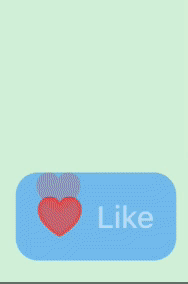
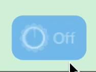

# Animatable

[](https://github.com/c-villain/Animatable/releases/latest)
[](https://swiftpackageindex.com/c-villain/Animatable)
[](https://swiftpackageindex.com/c-villain/Animatable)
[](https://swift.org/package-manager/)


[](https://t.me/lexkraev)
[](https://telegram.dog/swiftui_dev)

Yet another animation modifiers for buttons on SwiftUI.

<p align="left">
  
  </p>

🔍 Full demo video you can find [here](https://t.me/swiftui_dev/222).
    
👨🏻‍💻 Feel free to subscribe to channel **[SwiftUI dev](https://t.me/swiftui_dev)** in telegram.

## Requirements

- iOS 13.0 or macOS 10.15

## Installation

#### Swift Package Manager

To integrate ```Animatable``` into your project using SwiftPM add the following to your `Package.swift`:

```swift
dependencies: [
    .package(url: "https://github.com/c-villain/Animatable", from: "0.1.0"),
],
```
or via [XcodeGen](https://github.com/yonaskolb/XcodeGen) insert into your `project.yml`:

```yaml
name: YourProjectName
options:
  deploymentTarget:
    iOS: 13.0
packages:
  Animatable:
    url: https://github.com/c-villain/Animatable
    from: 0.1.0
targets:
  YourTarget:
    type: application
    ...
    dependencies:
       - package: Animatable
```

## Quick start

All examples you can find in demo project inside package.

There are different custom animation types provided by `Animatable`.

👇🏻 Tap on its name to see description and example of using.

<details>
  <summary>Live comments effect</summary>

<p align="left">

</p>

Use `.animate(.liveComments(stamps:),animate:)` where `stamps` is number of prints in animation activity, `animate` is flag to start animation.
                     
```swift
@State var animate: Bool = false
...
Button {
    animate.toggle()
} label: {
    HStack(spacing: 8)  {
        Image(systemName: animate ? "heart.fill" : "heart")
            .resizable()
            .scaledToFit()
            .animate(.liveComments(stamps: 4),
                     animate: animate)
            .frame(width: 24, height: 24)
            .foregroundColor(.white)

        Text("Like")
            .font(.body)
            .fontWeight(.medium)
            .foregroundColor(.white)
    }
    .padding(12)
    .background(
        Rectangle()
            .fill(.pink.opacity(0.8))
            .cornerRadius(12)
    )
}
```
</details>

<details>
  <summary>Explosion effect</summary>
  
  <p align="left">

</p>

Use `.animate(.explosive(color:),animate:)` where `color` is color of explosion in animation activity, `animate` is flag to start animation.

  ```swift
  @State var animate: Bool = false
...
  Button {
    animate.toggle()
} label: {
    HStack(spacing: 8)  {
        Image(systemName: animate ? "power" : "poweroff")
            .resizable()
            .scaledToFit()
            .animate(.explosive(color: .white),
                     animate: animate)
            .frame(width: 24, height: 24)
            .foregroundColor(.white)

        Text(animate ? "On" : "Off")
            .font(.body)
            .fontWeight(.medium)
            .foregroundColor(.white)
    }
    .padding(12)
    .background(
        Rectangle()
            .fill(.gray.opacity(0.8))
            .cornerRadius(12)
    )
}
  ```
  </details>
  
  <details>
  <summary>Tweak effect</summary>
  
  <p align="left">

</p>

Use `.animate(.tweaking(amount:,shakesPerUnit:),animate:)` where `amount` is tweak offset, `shakesPerUnit` is number of shakes in tweking, `animate` is flag to start animation.

  ```swift
  @State var animate: Bool = false
...
Button {
    animate.toggle()
} label: {
    HStack(spacing: 8)  {
        Image(systemName: animate ? "hand.thumbsup.fill" : "hand.thumbsup")
            .resizable()
            .scaledToFit()
            .animate(.tweaking(),
                     animate: animate)
            .frame(width: 24, height: 24)
            .foregroundColor(.white)

        Text("Like")
            .font(.body)
            .fontWeight(.medium)
            .foregroundColor(.white)
    }
    .padding(12)
    .background(
        Rectangle()
            .fill(.blue.opacity(0.8))
            .cornerRadius(12)
    )
}
  ```
  </details>
  
  <details>
  <summary>Scaling effect</summary>
  
  <p align="left">

</p>

Use `.animate(.scaling(scaling:),animate:)` where `scaling` is scaling factor, `animate` is flag to start animation.

  ```swift
  @State var animate: Bool = false
...
 Button {
    animate.toggle()
} label: {
    HStack(spacing: 8)  {
        Image(systemName: animate ? "plus.app.fill" : "plus.app")
            .resizable()
            .scaledToFit()
            .animate(.scaling(),
                     animate: animate)
            .frame(width: 24, height: 24)
            .foregroundColor(.white)

        Text("Add")
            .font(.body)
            .fontWeight(.medium)
            .foregroundColor(.white)
    }
    .padding(12)
    .background(
        Rectangle()
            .fill(.yellow.opacity(0.8))
            .cornerRadius(12)
    )
}
  ```
  </details>
  
<details>
  <summary>Rotating effect</summary>
  
  <p align="left">

</p>

Use `.animate(.rotating,animate:)` where `animate` is flag to start animation.

  ```swift
  @State var animate: Bool = false
...
Button {
    animate.toggle()
} label: {
    HStack(spacing: 8)  {
        Image(systemName: animate ? "arrow.triangle.2.circlepath.circle.fill" : "arrow.triangle.2.circlepath.circle")
            .resizable()
            .scaledToFit()
            .animate(.rotating,
                     animate: animate)
            .frame(width: 24, height: 24)
            .foregroundColor(.white)

        Text("Sync")
            .font(.body)
            .fontWeight(.medium)
            .foregroundColor(.white)
    }
    .padding(12)
    .background(
        Rectangle()
            .fill(.blue.opacity(0.8))
            .cornerRadius(12)
    )
}
  ```
  </details>
 
<details>
  <summary>Fireworks effect</summary>
  
  <p align="left">

</p>

Use `.animate(.fireworks(color:),animate:)` where `color` is color of animation, `animate` is flag to start animation.

  ```swift
  @State var animate: Bool = false
...
Button {
    animate.toggle()
} label: {
    HStack(spacing: 8)  {
        Image(systemName: animate ? "sun.max.fill" : "sun.max")
            .resizable()
            .scaledToFit()
            .animate(.fireworks(color: .white),
                     animate: animate)
            .frame(width: 24, height: 24)
            .foregroundColor(.white)

        Text("Weather")
            .font(.body)
            .fontWeight(.medium)
            .foregroundColor(.white)
    }
    .padding(12)
    .background(
        Rectangle()
            .fill(.blue.opacity(0.8))
            .cornerRadius(12)
    )
}
  ```
  </details>
  
  
  👇🏻 You can easily join them together to combine animation.
  
  <details>
  <summary>Combining animation</summary>
  
  <p align="left">

</p>

Use sequence of `.animate(type:,animate:)` to get multiple animation effect.

  ```swift
  @State var animate: Bool = false
...
Button {
    animate.toggle()
} label: {
    HStack(spacing: 8)  {
        Image(systemName: animate ? "sun.max.fill" : "sun.max")
            .resizable()
            .scaledToFit()
            .animate(.rotating,
                     animate: animate)
            .animate(.explosive(color: .red, factor: 2.0),
                     animate: animate)
            .animate(.explosive(color: .blue, factor: 1.4),
                     animate: animate)
            .animate(.fireworks(color: .yellow, factor: 3.5),
                     animate: animate)
            .frame(width: 24, height: 24)
            .foregroundColor(.red)

        Text("Combined")
            .font(.body)
            .fontWeight(.medium)
            .foregroundColor(.white)
    }
    .padding(12)
    .background(
        Rectangle()
            .fill(.blue.opacity(0.6))
            .cornerRadius(12)
    )
}
  ```
  </details>
  
### Recommendations for use

<details>
  <summary>with combining animation</summary>
  
  Order in sequence of `.animate(type:,animate:)` is really important!
  
  Feel the difference in the next example:

```swift
@State var animate: Bool = false
...
 Button {
    animate.toggle()
} label: {
    HStack(spacing: 8)  {
        Image(systemName: multiple ? "sun.max.fill" : "sun.max")
            .resizable()
            .scaledToFit()
            .animate(.liveComments(stamps: 4),
                     animate: animate)
            .animate(.rotating,
                     animate: animate)
            .animate(.explosive(color: .red, factor: 2.0),
                     animate: animate)
            .animate(.explosive(color: .blue, factor: 1.4),
                     animate: animate)
            .animate(.fireworks(color: .yellow, factor: 3.0),
                     animate: animate)
            .frame(width: 24, height: 24)
            .foregroundColor(.red)

        Text("Weather")
            .font(.body)
            .fontWeight(.medium)
            .foregroundColor(.white)
    }
    .padding(12)
    .background(
        Rectangle()
            .fill(.blue.opacity(0.6))
            .cornerRadius(12)
    )
}
```

Using this sequence of `.animate(...)` leads to such behaviour:

  <p align="left">

</p>

To get expected behaviour this we should change the order in chain:

```swift
@State var animate: Bool = false
...
 Button {
    animate.toggle()
} label: {
    HStack(spacing: 8)  {
        Image(systemName: multiple ? "sun.max.fill" : "sun.max")
            .resizable()
            .scaledToFit()
            .animate(.rotating,                // <== Look here!
                     animate: animate)
            .animate(.liveComments(stamps: 4), // <== Look here!
                     animate: animate)
            .animate(.explosive(color: .red, factor: 2.0),
                     animate: animate)
            .animate(.explosive(color: .blue, factor: 1.4),
                     animate: animate)
            .animate(.fireworks(color: .yellow, factor: 3.0),
                     animate: animate)
            .frame(width: 24, height: 24)
            .foregroundColor(.red)

        Text("Weather")
            .font(.body)
            .fontWeight(.medium)
            .foregroundColor(.white)
    }
    .padding(12)
    .background(
        Rectangle()
            .fill(.blue.opacity(0.6))
            .cornerRadius(12)
    )
}
```
The result:

  <p align="left">

</p>

</details>

  <details>
  <summary>with group of views</summary>

Use can use `.animate(...)` not only for one view but for group of views

  ```swift
  @State var animate: Bool = false
...
Button {
    animate.toggle()
} label: {
    HStack(spacing: 8)  {
        Image(systemName: animate ? "heart.fill" : "heart")
            .resizable()
            .scaledToFit()
            .frame(width: 24, height: 24)
            .foregroundColor(.red)

        Text("Like")
            .font(.body)
            .fontWeight(.medium)
            .foregroundColor(.red)
    }
    .animate(.liveComments(stamps: 4), // <== Look here!
             animate: animate)
    .padding(12)
    .background(
        Rectangle()
            .fill(.blue.opacity(0.8))
            .cornerRadius(12)
    )
}
  ```
  
  The result:
  
   <p align="left">

</p>

  </details>

</details>

  <details>
  <summary>with standart SUI modifiers</summary>

Be careful with standard SUI modifiers. It may cause different side effects.

For example [`cornerRadius`](https://developer.apple.com/documentation/quartzcore/calayer/1410818-cornerradius) crops the modified view. 

  ```swift
  @State var animate: Bool = false
...
Button {
    animate.toggle()
} label: {
    HStack(spacing: 8)  {
        Image(systemName: liveComments ? "heart.fill" : "heart")
            .resizable()
            .scaledToFit()
            .animate(.liveComments(stamps: 4),
                     animate: animate)
            .frame(width: 24, height: 24)
            .foregroundColor(.red)

        Text("Like")
            .font(.body)
            .fontWeight(.medium)
            .foregroundColor(.white)
    }
    .padding(12)
    .background (
        Color.blue.opacity(0.8)
    )
    .cornerRadius(12) // <== Look here!
}
  ```
  
  The result:
  
   <p align="left">

</p>

I recommend you to use it in the `.background` to get expected behaviour:

  ```swift
.background ( // <== Look here
    Rectangle()
        .fill(.blue.opacity(0.8))
        .cornerRadius(12) // <== Look here
)
  ```
  
  </details>

## Communication

- If you **found a bug**, open an issue or submit a fix via a pull request.
- If you **have a feature request**, open an issue or submit a implementation via a pull request or hit me up on **lexkraev@gmail.com** or **[telegram](https://t.me/lexkraev)**.
- If you **want to contribute**, submit a pull request onto the master branch.

## License

Animatable package is released under an MIT license.
